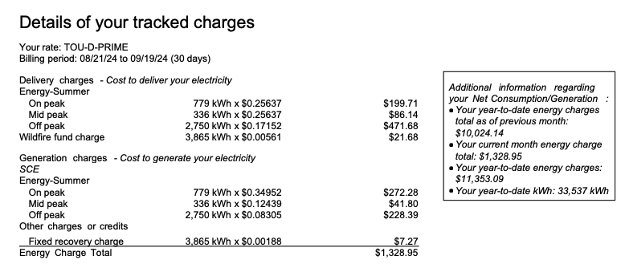

# Dormant Solar System Battery Backup Project ⚡️🔋

This repository documents the project to revive a **dormant solar power system** that was originally installed as a SolarCity system (later acquired by Tesla). The system has been inactive since the grid-tie inverter caught fire 5 years ago, and Tesla never resolved the issue.

The property currently faces a **$1,000/month power bill** 💰, and the homeowner does **not** wish to expand the solar panel array at this time. The goal is to implement a battery backup solution using the existing solar installation while maintaining NEM 2.0 net metering status.

---

## Project Overview 🌞

- **Install a new battery/charger/inverter system** in the detached garage.
- **Replace the existing 200A main panel** in the home.
- **Automatically shed high-load circuits** (e.g., laundry machine, electric hot water heater) during utility outages.
- **Reconfigure the Honda 3000 watt generator/inverter**, currently connected via a 6-circuit manual transfer switch, so it can feed the new system during outages.
- **Maintain NEM 2.0 status** to preserve the current net metering agreement.

---

## Existing System 🌐

- **Solar Panels:**  
  - **42 × 200 W panels** (total nominal capacity: 8.4 kWp).  
  - *Note:* These panels are **10 years old**, typically operating at roughly **90–95%** of their original capacity due to an approximate **5–10% efficiency degradation**.

- **Configuration:**  
  - Panels are string-tied (high voltage) on the detached garage.
  - The array feeds into a **power cutoff switch**, then runs to the home's **200A main service panel**.

- **Generator Setup:**  
  - A **Honda 3000 watt generator/inverter** is connected via a **6-circuit manual transfer switch**.
  - The plan is to reconfigure this generator to feed the new battery/inverter/charger system during outages.

- **Current Status:**  
  - The original grid-tie inverter was destroyed by fire and has not been replaced, leaving the system dormant.

---

## Equipment and System Design 🔧

- **Battery/Charger/Inverter System:**  
  - **Battery Options:** Preferred option is **Victron**; however, Tesla, Franklin, or other brands will be evaluated based on **cost per amp-hour** and overall system compatibility.  
  - **Inverter:** Open to installer recommendations. A hybrid inverter capable of both grid-tie and battery backup operation is required to integrate the existing solar array and the new battery system.

- **Load Shedding:**  
  - The system must automatically disable high-draw circuits (such as the laundry machine and electric hot water heater) during outages to ensure efficient use of backup power.

- **Main Panel Upgrade:**  
  - Replace or upgrade the existing **200A main service panel** to accommodate the new system components.

- **No Additional Solar Panels:**  
  - The homeowner does **not** wish to install any additional solar panels.

- **NEM 2.0 Compliance:**  
  - All modifications must preserve the current NEM 2.0 net metering status.

---

## Installer Requirements 🛠️

Only installers who are **licensed, insured, and bonded** should submit a quote. **Proof** of licensing, insurance, and bonding must be provided at the time of quoting.

Installers are expected to:
- Provide detailed recommendations for the battery, inverter, and load-shedding configuration.
- Ensure the design meets local electrical codes and maintains NEM 2.0 compliance.
- Evaluate the system’s energy efficiency, accounting for the approximate **5–10% efficiency degradation** of the 10-year-old panels.
- Deliver a comprehensive plan that integrates the existing solar infrastructure with the new backup components.

---

## Image Gallery 📸

---

## Power Bill 💡

- **Monthly Power Bill:** Approximately **$1,000 per month**.  
  This significant utility expense is a key driver behind implementing a battery backup system that leverages the existing solar array to reduce grid dependency.

### Bill Documentation 📊

